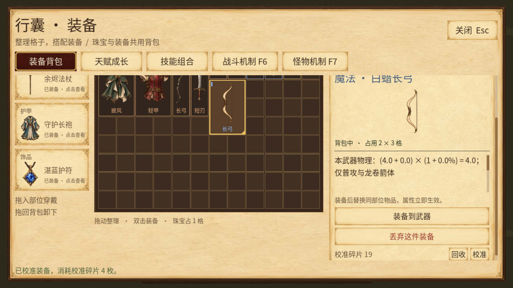
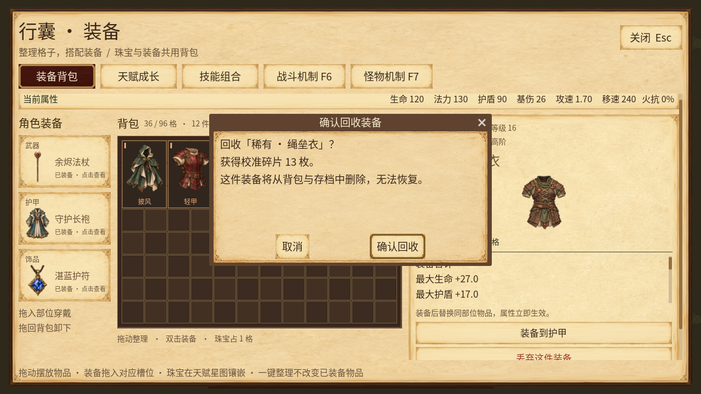

# v0.15：回收与数值校准

在 I 的原物品详情操作区增加一行碎片余额、回收和校准。制作只服务已有构筑：本版没有新增材料掉落、升级赠料、底材、词缀种类、升阶、定向制作或地图。

## 可操作范围与经济

仅限自己背包中未穿戴、带词缀的随机魔法或稀有装备。固定示例/机制装备、普通无词缀装备和珠宝不适用；先卸下装备才能操作。覆盖当前9底材、19词缀族的合法实例，资格和数值范围都来自 EquipmentCatalog。

| 操作 | 结果 | 首版成本/收益 |
|---|---|---|
| 回收 | 消耗这一实例，释放其格子，获得校准碎片 | 魔法基数1、稀有基数3，再加所有词缀的阶级之和 |
| 数值校准 | 每条词缀在原档位的整数掷值范围内重掷 | 该装备回收收益的2倍碎片 |

当前魔法回收2–7枚、校准4–14枚；稀有回收7–21枚、校准14–42枚。本游戏T1入门、T3高阶，与PoE档号方向不同。这些比例是可调的原创原型平衡，不是PoE货币价格。

校准保持物品ID、底材、物品等级、稀有度、词缀种类、顺序和阶级；只改变已有数值。结果可以相同或更低，仍按完整成本结算。既有前后缀容量、词缀族、局部武器与攻击/法术作用域不会被制作改写；局部物理显示重新走真实装备目录派生。

## 报价、种子与提交

纯规则来自 CraftingRules，纯候选来自 CraftingTransactionPlanner；真正的所有权、完整构筑、签发状态和磁盘提交由 BuildState 负责。UI控件只显示报价并发送请求。

1. 模型先验证完整当前构筑，再为具体操作/物品签发短期句柄。模型内部保存规则报价、完整快照、原实例、保存目标和已存在文件的内容摘要；UI不能用自己拼接的报价代替签发记录。最多保留8份，过期的重新请求即可。
2. 提交再次比较源实例和完整构筑，重算权威报价；构筑改变、重新载入、取消、重复确认、换模型或伪造句柄都不能重用旧操作。每次加载尝试都会清空旧句柄。
3. 实际种子只由规则版本、成功制作序号与规范源装备摘要派生。UI不传种子，也不预览随机结果。取消和写盘失败不推进序号；同一状态重试或重载得到同一结果。改变经验、背包位置等只使报价过期，不提供免费换种子路径。
4. 规划器生成独立候选，再放回完整存档做背包、装备身份、珠宝、天赋连通和版本验证。
5. 先完成受保护的原子写盘，成功后才同时替换内存中的实例/持有关系/位置/材料/序号并发出一次 changed。失败不动这些字段，也不发变化信号；原始旧档备份失败会一起拒绝。
6. 主场景用完整序列化字节识别“已保存的制作通知”，只刷新，不重复自动保存。回调若又改变经验等内容，旧收据立刻失效，该新变化照常保存。制作通知中再次制作会被拒绝。

回收有明确的物品名称、收益和永久消耗确认；校准确认展示成本与“可能降低或不变”。取消不消耗。按下后换选中物品不会把旧请求改投给新物品。自动变化不会跳过确认。

已有文件在报价后被外部改写时，提交拒绝并保护该路径；损坏或未来版本文件也不能经制作覆盖。原文件身份使用v0.14已修复的大小写/目录身份规则。这里不承诺多进程同时写入的跨进程锁，也不提供外部手工恢复旧存档的反作弊保证；恢复加载会清空旧报价。

## 存档兼容

存档为schema11，原16字段不改语义，只增加第17个 `crafting`：

```json
{"materials":{"calibration_shard":0},"revision":0}
```

材料与成功制作序号均为0–1,000,000,000的整数，避开JSON大整数精度问题。未知材料、额外字段、负数、小数、布尔值或超界值拒绝整份存档。纯规划器的64位范围不是游戏存档的额度上限。

历史v1–v10加载后材料和序号均从0开始，不发免费材料、不重掷旧装备。首次覆盖原路径前保留原始BOM/换行/空白字节备份，v10后缀为 `.v10-backup.json`。装备词汇仍明确映射到v9；贯穿沿用v10辅助词汇。未知未来版本继续拒绝。

## 同源资料与验收

[离线制作图鉴](reference/index.html#crafting-calibration_shard)新增一材料/两操作条目，回收与校准流程值来自实际规则/规划器，完整候选经过BuildState验证。示例不是玩家下一次结果，也没有读写用户存档。

已执行定向检查：规则91,707、纯事务14,155、状态222、真实场景保存协调36、原控件228、主背包UI41；图鉴数据759与静态锚点/链接/图片检查通过。最终原串行完整套件60份报告共2,043,631项检查通过，另21项字体回归通过；600秒模拟3912有效击杀、118件装备，峰值持有14/场上71。Linux路径身份和历史备份87项通过。Windows导出177个PCK资源逐项哈希通过；提取同一PCK在隔离Linux存储启动300帧通过，包内890字字体原始字节与源文件SHA完全一致。

云端Linux实际鼠标完成回收取消、两次确认回收、校准取消与确认：余额0→13→23→19，成功序号0→3，校准消耗4。本次掷值5→5，正确保留“不保证改善”的语义；每次磁盘内容与完整快照相同。夹具只准备3件合法目录装备、固定选择和停止模拟，没有赠送材料或替换制作结果。

独立控件8组真实720p/2K渲染、2604检查通过。720p另测OS指针；2K因宿主桌面物理边界，明确使用Godot公开Window.push_input引擎GUI事件，未测2K物理鼠标。未修改任何原断言，保留像素尺寸、全文、窗口边界、焦点对比与42次允许请求检查。

新控件焦点文字已改为纸面深墨；长tooltip按有界宽度自动换行，完整187字压力文本可读。确认框使用局部木色标题条与浅色标题，保留继承字体缩放和现有布局。





v0.14的Windows存档/字体专项是历史证据，不等同于本版schema11或最终EXE的Windows原生验收。本版尚未执行Windows成品GUI或离线HTML浏览器交互验收。
