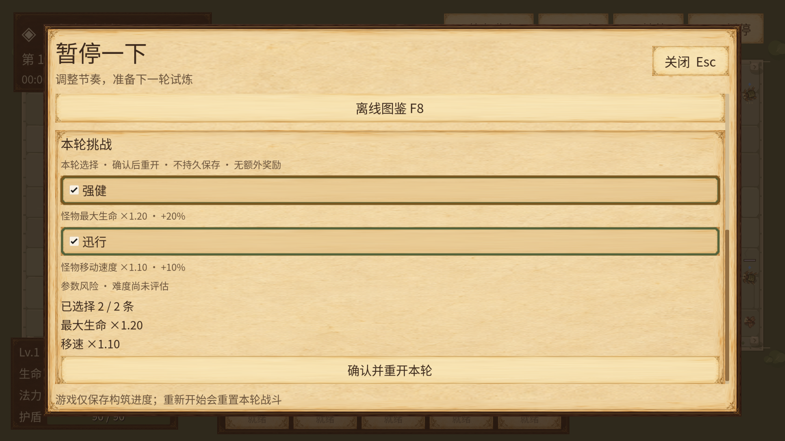
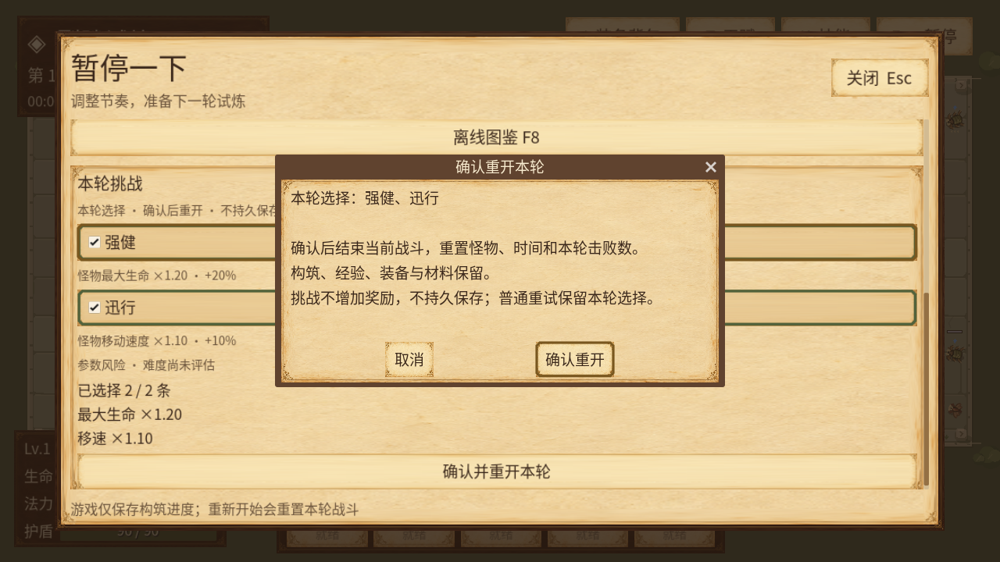
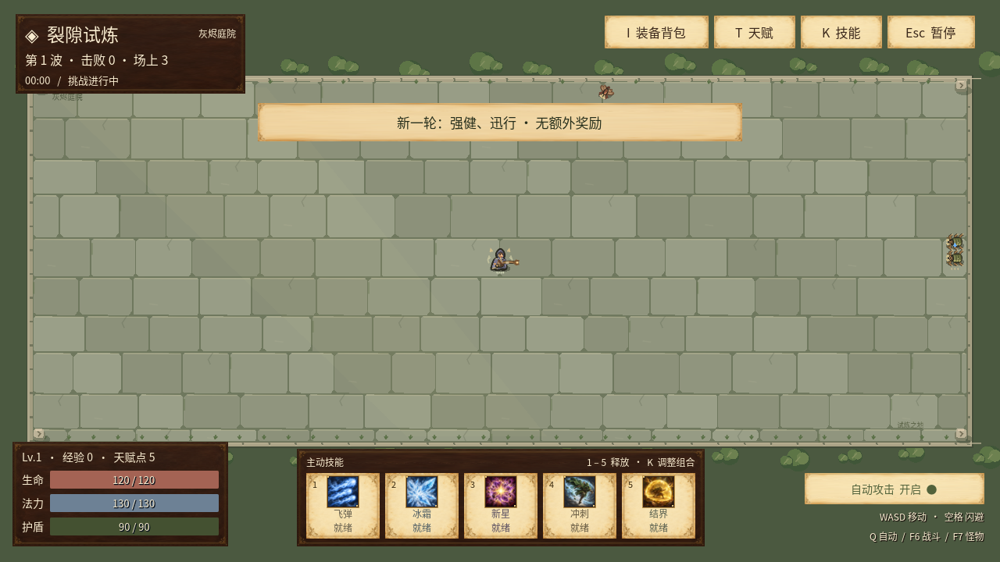

# v0.17：本轮可选挑战

Esc暂停后向下滚动，可以选择强健、迅行或两者。确认会重开当前战斗；不确认只改变草稿。该功能是有限本轮参数挑战，不是完整终局地图系统。

## 选择、重开与保存

- 强健：标准怪物最终最大生命×1.20，当前生命同步按比例调整；不改变护盾。
- 迅行：标准怪物最终移动速度×1.10；不改变攻击速度、伤害、减速与击退。
- 可选零、一、两项，参数来自同一EncounterCatalog/Compiler；UI与图鉴没有另一份倍率表。
- 具体确认框列出所选项，并明确重置怪物、时间、本轮击败数；构筑、经验、装备、珠宝与校准材料保留。取消、重复确认、旧轮次确认或切换页面都不能误开新一轮。
- 普通“重新开始”保留本轮选择；恢复常规、F7试验场及百怪试验清空。重新加载游戏从常规开始，挑战选择不写入存档，schema11保持。
- 无额外经验、装备掉落、制作材料或地图物品；仍获得原本符合资格的奖励。参数变化不合并成虚构的综合难度或DPS评分。

这是本游戏原创平衡。倍率作用在物种、波次、稀有度和共用机制已经生成的标准怪物最终字段上，不冒充PoE同名“提高”分组公式。

## 根怪、子怪与失败回滚

一局持有同一份递归只读配置。根怪在MonsterRuntime.create_root后、加入enemies前应用一次；死亡子怪先由原runtime赋好谱系、身份和零奖励资格，再以各自的新标准数值应用同一配置。不会继承父怪已经变换过的最大生命，不每帧重复乘算。

空选择完全沿用旧怪物形状，没有encounter_source标记。非空选择只改生命、最大生命、移速，增加只读来源记录；攻击分量、防御、半径、出生保护、根/父身份、代数、经验与奖励资格保持。灰烬守卫仍执行v0.16固定预警重击，挑战不改变其伤害或警示时间。

非法、过期或与本轮ID不匹配的配置，在随机抽取或创建身份前拒绝。生成后的意外变换失败，由新的EncounterAdmission事务恢复尚未发布的ID计数、roots、FIFO队列和trace；主场景恢复本次生成使用的RNG。子怪整批先验证完才加入模拟，一只失败不留下前半批，不改成普通怪。失败回滚不撤销已经真实完成的父怪死亡或其合法奖励。

失败批次中的ID没有进入模拟或被事件消费者看到，因此可在重试时分配原连续编号；已经入场的来源身份及重开的单调编号规则保持。没有跨进程签名、反作弊或保存遭遇的承诺。空队列/零容量不复制完整谱系快照。

## 原有界面里的真实状态

保留暂停面板原布局与滚动容器；新增两项勾选及同源预览，确认重开才提交。HUD用等长“挑战进行中/挑战已暂停”提示，详细选择在悬停说明里。沿用纸面、深墨、旧金属边框与木色确认标题；焦点文字明确保持深色，长tooltip保留全文并限宽换行。

[本轮挑战图鉴](reference/index.html#encounters-enemy_max_health_120)包含真实编译前后条形图，覆盖巡游体、灰烬守卫、孵化重壳体；数值与来源记录直接由实际Compiler生成。制作、怪物预警、武器本地伤害等既有资料继续同源导出。

## 验收与范围

定向检查：主流程1238、实际暂停UI64、独立控件695、编译器5145、真实谱系组合19301项均通过。覆盖无/单/双选择、故障注入回滚、重复应用拒绝、自然第8次守卫、百怪上限、三代生成、一次根奖励、零子奖励、选择不保存和菜单中断。

实际Linux鼠标流程完成：勾选两项→打开具体确认→取消→重新确认开始→普通“重新开始”保留两项→清空选择确认恢复常规。真实初始巡游体生命38→45.6、移速65.4→71.94；重试后仍有同源标记，恢复常规后新怪没有标记，完整构筑始终相同。

另完成720p/2K × 默认/120%字体（高字体时UI110%）的8张真实菜单与确认框渲染，最大字号无横向裁切。夹具只隔离存档、固定下一轮RNG、等待实际菜单输入时持住模拟，并在各阶段重开/滚动菜单。矩阵阶段以程序设置草稿和打开确认，只证明渲染；不作为2K物理鼠标证据。原始报告中的cancel_count包含后续渲染矩阵取消，实际交互取消在日志的流程完成标记之前。

字体从892增加到904映射字符，新增“健典参层政策评遇遭险难集”，保留全部既有字符、字形、字宽与行高。原有装饰符号fallback限制保持。

原串行完整验证68份计数报告共2,083,616项检查通过，另21项字体回归；600秒3926有效击杀、118装备，峰值持有14/场上72。Windows x86_64导出191项PCK资源与35份原画逐项哈希通过，同PCK隔离Linux300帧启动及包内904字字体证明随冻结清单保留。尚未验收Windows成品原生GUI、2K物理鼠标或离线HTML浏览器交互；软件渲染不代表目标硬件性能。

