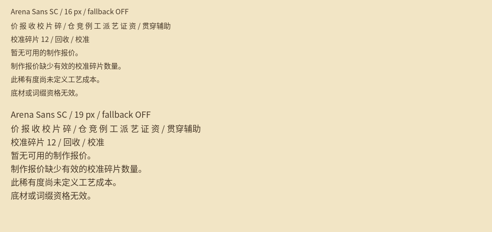

# 中文字体覆盖与重建

本次修复保留 `Arena Sans SC` 的现有字形、字宽、行高、字号和导入设置，从相同 Noto Sans CJK SC 原字体增量补字。没有改动 UI 布局、制作控件、核心脚本、游戏机制或 `tools/validate.sh`。

## 文件所有权与输入

本任务独占 `assets/fonts/*` 和字体覆盖工具，实际修改范围为：

- `assets/fonts/arena_sans.otf`：现有字体子集。
- `assets/fonts/coverage_manifest.json`：冻结的旧覆盖、字形与度量指纹、同源文件哈希、制作字符串及生成记录。
- `tools/subset_font.py`：现有生成入口。
- `tools/check_font_coverage.py`、`tests/test_font_coverage.py`：新增覆盖检查和回归测试。
- 本文及 `docs/font-coverage/*`：验证记录和真实 Godot 文本截图。

运行时基线为 v0.14 集成分支最终提交 `59f173c533ba3d9ff79fdcee7ac665a15d80a67c`，与初始集成提交 `e570b2b4596c908d82968117b90570a0ea515ea3` 的运行时字符串、字体字符映射、轮廓与度量一致。其字体覆盖包含 main v0.13 提交 `a4a306a6d8c14320fce383dccf6ad7ca40836757` 的全部 857 个映射字符。v0.14 基线字体为 328,196 字节，真实 Unicode cmap 为 860 个映射；生成器的“请求字符数”不能代替 cmap 覆盖数。

此外，只读制作控件提交 `c2e711bdcccaefbbfdcc7bb9e8dd41db5010287f` 的两个文件：`scripts/ui/crafting_controls.gd`、`scripts/items/crafting_rules.gd`。清单保存其中全部 23 条包含中文的字符串、行号与原 Git blob 的 SHA256；没有引入、执行或修改该分支的控件/机制。

原生成脚本只扫描脚本、场景全文和 `passive_balance.json`，重建时可能删除不再出现的旧字符，也不能发现上游字体不支持的符号。这个冲突已在修改前报告。现在生成与检查共用同一份文本扫描，并取“当前已覆盖字符 ∪ 冻结基线 ∪ 当前运行时字符串 ∪ 制作字符串”的超集。

## 字体来源与许可

环境已安装 `/usr/share/fonts/opentype/noto/NotoSansCJK-Regular.ttc`，来自 `fonts-noto-cjk` 包 `1:20240730+repack1-1`；本次没有下载或更换字体。采用 TTC 第 2 个 face：`Noto Sans CJK SC` Regular，版本 `2.004;GOOG;NotoSansCJKsc-Regular;ADOBE`。其全部基线字符的轮廓、水平/垂直度量与现有子集一致。

- 上游：[Noto CJK 官方仓库](https://github.com/notofonts/noto-cjk)。
- 源 TTC SHA256：`b76b0433203017ca80401b2ee0dd69350349871c4b19d504c34dbdd80541690a`。
- [现有许可文件](../assets/fonts/OFL-NotoSansCJK.txt) 按字节保留，且与系统源包的 `copyright` 文件一致；SHA256 为 `849f4ea9c214fa4ac3593b770c699f387534b11ce671264c1b10d85bdcb5997b`。
- 字体内嵌的版权、SIL OFL 1.1 声明和上游元数据保留，修改后的家族名仍为 `Arena Sans SC`，PostScript 名仍为 `ArenaSansSC-Regular`。

生成器拒绝不匹配的源哈希、地区 face、版本、旧字形或度量。源文件缺失时检查现有子集仍可运行，重建必须报告缺失；如需恢复源文件，只能使用可核验的官方来源，并在修改清单前验证许可和旧字形一致性。

## 检查范围与结果

检查 48 个运行时文本文件及冻结的制作字符串：`project.godot`、`scripts`/`scenes` 内的 GDScript 与文本资源、`data` 内 JSON/CSV、`assets` 内文本 Godot 资源。遵循 `.gdignore`，不把离线参考库、测试夹具、文档或素材生成提示算成运行时 UI。所有 GDScript 字符串都纳入检查，包括错误提示和目录标签，不只检查按钮六字。

扫描器跳过注释，支持普通/原始/三引号字符串、转义引号、续行、StringName、NodePath、Unicode 转义及代理对；JSON 先解码再提取嵌套字符串，CSV 按单元格读取。未知转义或坏文件直接失败。将来新增其它文本容器或程序拼接码点时，需扩展输入；任意用户/下载文本不在静态保证范围内。

当前并集包含 **753 个中文字符、855 个可打印字符**。v0.14 基线缺少的中文为：

`仓价例工报收校派片碎竞艺证资`

修复后 cmap 为 **874 个字符**，字体 332,756 字节。旧 860 字符全部保留；其轮廓、水平/垂直 advance、垂直原点和全局行高度量指纹保持一致。每个必需中文必须映射到非零、非 `.notdef`、具有绘制轮廓的字形。

重建结果 SHA256：`64e13b9670cb12fe906d1adf736df5aa6d90019aa2b9cdab49559ac75976cea2`。在 fontTools 4.61.1 下连续重建得到相同字节；生成器固定原有字体时间戳，避免重建时间改变产物。

### 两个既有符号限制

同源 Noto CJK 文件没有 `⌁`（U+2301）和 `◈`（U+25C8）；它们原已出现在 `passive_panel.gd` / `game_hud.gd`，旧字体也没有。清单只对这两个既有符号明确记录缺口，检查报告始终列出它们；中文不能被豁免。

没有拼入其它字体、制作替代字形或改掉 UI 符号。现有 `allow_system_fallback=true` 导入设置保留，因此这两个装饰符号仍依赖目标系统回退；本次不声称覆盖它们。`--strict-symbols` 会将该限制转为失败。

## 可重复执行

检查/重建需要 Python 和 fontTools，运行游戏无需这些开发依赖。本次验证使用 fontTools 4.61.1。

```sh
python3 tools/check_font_coverage.py
python3 tools/check_font_coverage.py --json
python3 tests/test_font_coverage.py
```

退出码：0 表示中文/旧覆盖/字形度量与许可证通过，1 表示覆盖或退化失败，2 表示输入/执行失败。缺字报告包含 Unicode 编码及源位置；JSON/CSV 位置按文件/记录标识，不声称嵌套 JSON 的精确源行号。

如本地具有制作提交的 Git 对象，可额外核验冻结的字符串确实完整匹配该提交：

```sh
git fetch origin codex/crafting-controls-v013-desktop-fbrtnr7
python3 tools/check_font_coverage.py --verify-supplemental
python3 tools/check_font_coverage.py --strict-symbols
```

最后一条会因已记录的两个装饰符号返回 1，这是预期的严格审计结果。

新增文本后用已核验的源字体重建，再运行检查和测试。生成前先验证源与旧字形，生成后的覆盖检查全部通过后才写入子集；不会以请求字符数冒充成功覆盖。

```sh
python3 tools/subset_font.py /usr/share/fonts/opentype/noto/NotoSansCJK-Regular.ttc
python3 tools/check_font_coverage.py --verify-supplemental
python3 tests/test_font_coverage.py
```

## Godot 原生映射与小文本渲染

```sh
python3 tests/test_font_coverage.py --godot godot
# 需要可用的图形显示环境：
python3 tests/test_font_coverage.py --godot godot --render-dir /tmp/font-qa
```

测试在临时工程中导入完全相同的字体二进制和 `.import` 设置，隔离 XDG 设置、缓存与存档。只启动字体探针，不启动游戏或制作模型。探针在自身字体实例关闭系统回退并清空 fallback 数组，逐字符验证唯一原生字体 RID 的 `font_has_char` 和非零 glyph index，并检查每个中文字符的 Godot 栅格范围和缓存纹理。

已在 **Godot 4.6.3 official、Linux X11、16px 与 19px** 完成：874 × 2 = **1,748 次原生映射验证**，753 × 2 = **1,506 次中文栅格验证**。16px 为现有主题默认字号，19px 对应 120% 字体缩放的取整值；本次没有修改任何产品字号。实际 viewport 使用 `draw_string` 渲染中文，保存并人工查看以下截图：



证据：[覆盖报告](font-coverage/coverage-report.json)、[Godot 结果及产物哈希](font-coverage/godot-probe.json)。API 依据：[FontFile](https://docs.godotengine.org/en/stable/classes/class_fontfile.html)、[TextServer](https://docs.godotengine.org/en/stable/classes/class_textserver.html)、[GDScript 字符串转义](https://docs.godotengine.org/en/stable/tutorials/scripting/gdscript/gdscript_basics.html#literals)。

19 项回归测试覆盖完整并集、六字之外的错误文本、旧覆盖丢失、`.notdef`、空字形、字宽/行高变化、许可保留、未经验证的源拒绝、转义/JSON/CSV 和严格符号审计。修复前字体运行同一检查可复现 14 个中文缺字，修复后中文缺字/旧覆盖退化/空中文字形均为零。

Linux 原生字体探针与截图不等同于 Windows 导出包的整机验收；制作控件的 Windows 实际交互由主集成另行核验。
