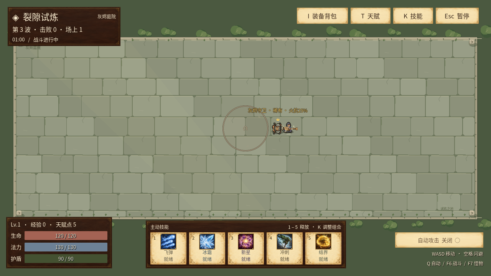

# v0.16：灰烬守卫锁点重击

第3波开始自然出现的灰烬守卫，现在用一次可躲避的地面重击代替贴身接触攻击。既有入场节奏、25%火抗、原始死亡的一次防御装备奖励、体型与移动速度保持；没有新增怪物、地图、装备、存档字段或免费奖励。

## 实际规则

- 来源与玩家距离不超过150世界单位，出生保护及初始攻击延迟结束，且没有正在进行的动作时，锁定玩家此刻的世界位置。
- 预警固定0.7秒，半径从第一帧就是90世界单位，不追踪玩家，不用逐渐扩大的圈暗示错误范围。真实圆形命中包含玩家15世界单位半径，中心距离105以内（含边界）命中。
- 蓄力结束只产生一个事件。其防御前物理/火焰分量来自开始时来源的接触伤害基底，各乘1.4；之后改变来源位置、伤害或攻速不改变本次动作。
- 实際结算使用命中时的玩家位置与防御：火抗→护盾→生命，沿用0.32秒无敌帧。多个来源同帧落下不会绕过无敌帧。重击事件不是必然受伤记录，范围外或无敌均不造成这次伤害。
- 恢复默认1.2秒，按 `1.2 × 原攻击速度 / 当前攻击速度` 缩放；速度输入下限0.2、恢复安全范围沿用配置限制。攻速不会缩短0.7秒预警。因此动作频率不会与攻速简单线性等同，也不把伤害/动作时长当实测DPS。
- 蓄力和恢复期间暂停主动追击，敌人间分离及击退仍正常；原地范围不跟着来源漂移。恢复结束后可重新发动一次完整预警。
- 灰烬守卫不会在预警、恢复或非法配置时回退为瞬时接触攻击。其他六种怪物模板继续原来的接触规则。

数值与时序是本游戏原创初版平衡，不声称是PoE逐字规则。纯调度器仍可容纳100来源，但自然玩法只给灰烬守卫启用；这不表示每一屏都有100个重击。

## 时序与取消

主循环在递减出生保护前推进已经存在的预警，用完整来源集合确认存活；消费事件后才更新怪物移动。新动作在整个tick尾部入场，不能借用这一帧已经经过的时间，出生保护结束后仍保留完整预警。

来源死亡、移除、重新进入出生保护或已处理死亡时取消，取消没有终止爆炸。真实击杀在死亡结算处立即取消，未处理的移除也会在下一次完整快照取消。重开、试验场切换和玩家死亡清空运行时，已返回但未消费的事件在玩家死亡后丢弃。暂停菜单冻结计时，恢复后从同一状态继续。

运行时与原生渲染器分别独立，有界副本只用于画地面提示。低特效保留完整边界及必要符文，恢复只原地消退；角色画在提示上层，UI布局与视距保持。状态、事件及诊断记录均不持久化；存档仍为schema11，历史原字节备份规则保持。

## 同源图鉴

[锁点重击条目](reference/index.html#monster_attacks-locked_circle)直接从实际MonsterCatalog策略、TelegraphProfiles、TelegraphedAreaRuntime事件、圆形相交方法和DefenseRules生成。站定、穿普通灰烬皮甲、直线移出的三个例子共用同一事件；护盾10、生命100是明确给定的演算输入。

第3波原始伤害32.592，普通灰烬皮甲15%火抗后为30.1476，只减少火焰半份；直线移动示例来自角色实际速度×预警时长，假设立即开始、无阻挡，移出范围后没有结算记录。图鉴不预测每位玩家一定成功躲避，也不把示例伤害写成DPS。

## 已验证与限制

- 独立运行时882项、主场景接入72项、原火抗/真实装备场景317项、同源导出768项通过；覆盖出生保护、完整预警、锁点/伤害快照、碰撞边界、攻速恢复、死亡/重置/暂停、100来源与有界记录
- 绘制组件headless12525项；X11/Mesa llvmpipe真实渲染12745项，12组真实像素半径检查通过，低/高特效边界一致；软件渲染证据不代表Windows或目标GPU帧率
- 720p/2K两档、低/高特效、预警/命中/躲避共12张实际主场景画面通过；2K是实际渲染，不是物理鼠标验收
- 720p实际键盘短按D移动8单位后受32.592伤害，护盾90→57.408；持续按D移动约172单位后范围落空，护盾90保持。键盘操作走现有移动与固定tick，没有改攻击、生命、护盾或移动速度
- 隔离夹具通过第3波第8次真实入场获取守卫，移除其他来源以隔离一次攻击，安排站位，跳过出生/初始延迟，关闭自动攻击与后续刷怪；渲染阶段之间暂停模拟。没有修改来源数据或给予无敌
- 中文字体增加“圆、蓄”至892映射字符，旧字体字形/字宽/行高保持；原有装饰符号fallback限制保持

原串行完整验证63份计数报告共2,057,122项检查通过，另21项字体回归；600秒模拟3926有效击杀、118装备，峰值持有14/场上72。最终导出与逐项哈希/同包启动记录随冻结清单保留。本版尚未完成Windows成品原生GUI、2K物理鼠标或离线HTML浏览器交互验收。

