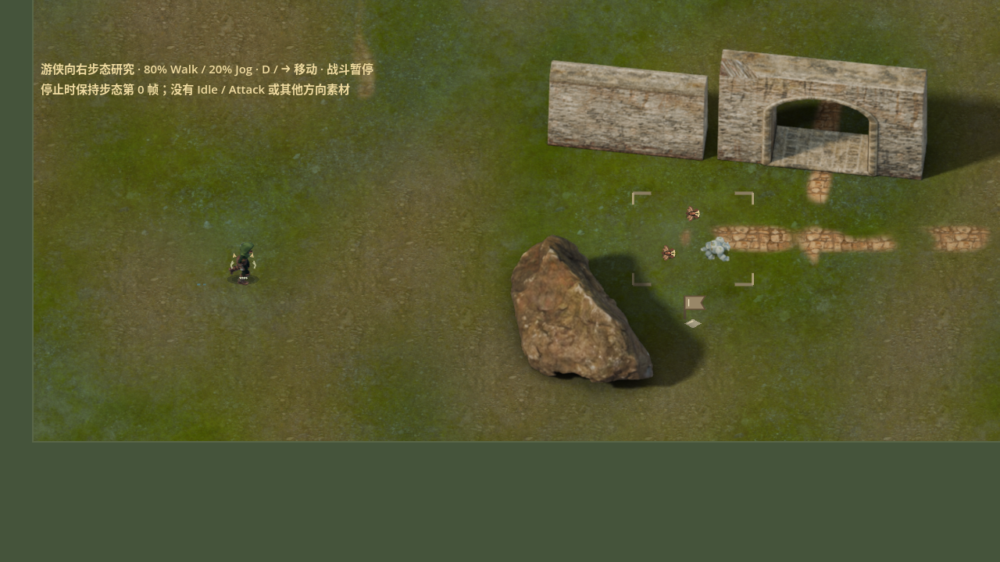

# v125 single-heading native movement preview

Source: `1cd353b68be4f45922de8de31ba4fff93252dc36`, based on main
`840dc562c1fd3ed74ac34d221d3bdc922d837f59`. The original 16 archived PNGs and
their manifests pass `art-studies/v125/scripts/verify_archive.py`. Their decoded
RGBA pixels are copied unchanged into one 2048x192 atlas; see
`packing-result.json`. Source meshes, animation poses and the archived research
files are not edited.

Run from the repository root:

```sh
tools/run_ranger_motion_study.sh
tools/run_ranger_motion_study.sh -- --auto
tools/run_ranger_motion_study.sh --headless -- --verify --report=/tmp/ranger-check.json
```

The standalone entry creates a fresh isolated `/tmp` data directory, enters one
native old_garden map with all 25 original roots already resident, then pauses
combat. Only actual `Main._move_player` and existing presentation/effect code
advance. D/right-arrow moves east; automatic mode makes one four-cycle pass.
The formal default scene and hero selection are unchanged. The HUD is hidden
and Main's action hotkeys are disabled in this study process.

The presentation definition explicitly declares `direction_count: 1`; no
other headings are synthesized. The optional catalog field accepts 1 or 8,
defaults to 8 for existing definitions, and validates the exact corresponding
frame count. Drawing, frame clocks, culling, shadows and reset use the existing
ActorVisual/Catalog/RetainedActorLayer path. Main._draw performs one pose
observation per rendered movement; the launcher does not double-sync the pose
and accidentally reset moving frames to idle.

The fixed 80% Walk / 20% Jog cycle is 0.7436822467 seconds, 16 held phases.
Source cells are 128x192, foot [64,158], world scale `1 / (2 * 0.65)`.
The measured game canvas projects each cell to 64x96 and actual east movement
to 155.998–156.000 screen pixels/second at the unchanged 240 world units/second.
Idle and attack use an explicitly declared hold of locomotion frame 0; there
is no authored Idle or Attack art. A presentation-only attack cue keeps the
existing half-second interval without issuing a gameplay attack.

| Focused check | Result |
| --- | --- |
| Movement-only headless verification | 46 checks, zero failures |
| Native OpenGL capture, X11 / Mesa llvmpipe | 62 checks, zero failures; all 16 phases captured |
| Existing presentation resource contract | 314 checks, zero failures |
| Existing presentation swap pose | 14 checks, zero failures |
| Existing actual Main adapter | 27 checks, zero failures |
| `git diff --check` | Passed |

The movement checks preserve roster/IDs, health/mana/shield, attack/cooldown
values, character state, geometry and exact save bytes; they test scale/foot
mapping, phase wrap, stationary hold, shadow bounds/retained commands and clear
to the default hero. The native view at phases 0/4/8/12 was inspected: the hood,
legs and boot silhouettes remain readable at actual size, and the contact
ellipse stays at the common ground root as feet alternate. The contact shadow
half size is [32,10] world units. Existing ward overlays remain visible.



This is a movement study, not natural combat or a complete eight-direction
production character. Authored boot penetration/clearance, sampled source
projection and discrete held-frame stepping retain their documented limits;
the reported approximately 0.536 display-pixel maximum penetration is not an
automatic rejection and is not corrected here. No pixel-perfect contact or
full continuous foot lock is claimed. No need for a source pose change was
confirmed by this integration check.

Whole-repository editor import also encountered two unrelated existing QA
image failures (`v116-ruins-garden-entry/native-entry.png` and
`v118-ground-dressing/native-map.png`); the changed atlas imported successfully
with mipmaps and all focused tests above ran. Native audio was unavailable and
fell back to the dummy driver; that does not affect the captured graphics.
No long-duration test, Windows FPS measurement, Windows export or packaging
was performed. Performance work is on a separate branch and is absent here.
